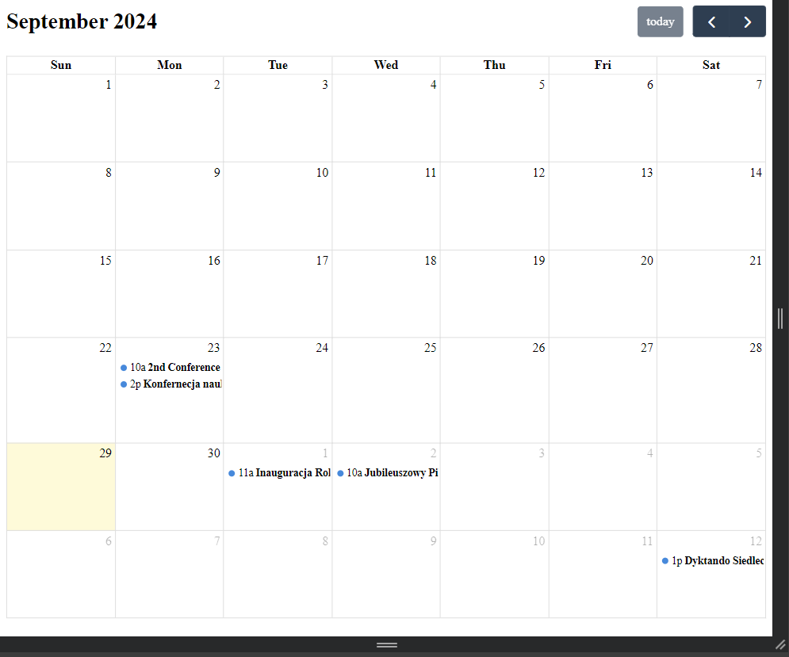

# Description
Calendar app to develop (first version)
 

# Used:
-pycharm 2024.1  
-Git  
-API from UWS (Uniweristy from Siedlce)  
-modules: pip, request, flask  
-Chrome

# Setup
1. run app.py file
2. open: http://127.0.0.1:5000
3. enjoy :)
  
 
### Done
-Widok miesięczny kalendarza: Przeglądaj wydarzenia zaplanowane na dany miesiąc.

 
### Todo
-Szczegóły wydarzenia: Po kliknięciu na konkretne wydarzenie, użytkownik powinien móc zobaczyć jego szczegółowe informacje.
